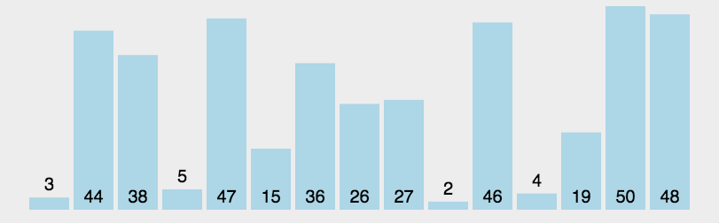

# 算法类
[参考](https://www.cnblogs.com/onepixel/articles/7674659.html)

## a^n 怎么用小于 O(n) 的算法实现

## 快排的原理
快速排序的基本思想：通过一趟排序将待排记录分隔成独立的两部分，其中一部分记录的关键字均比另一部分的关键字小，则可分别对这两部分记录继续进行排序，以达到整个序列有序。


## 数组去重
```javascript
function unique(arr) {
    var array = [];
    for (var i = 0; i < arr.length; i++) {
        if (array .indexOf(arr[i]) === -1) {
            array .push(arr[i])
        }
    }
    return array;
}
```
## 写一个函数判断是否存在循环引用

## 排序算法，时间复杂度


## 平衡二叉树
