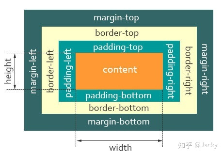
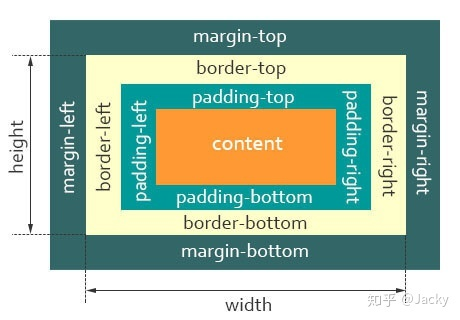
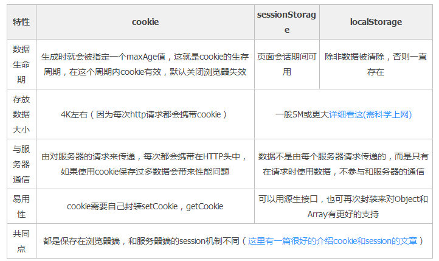
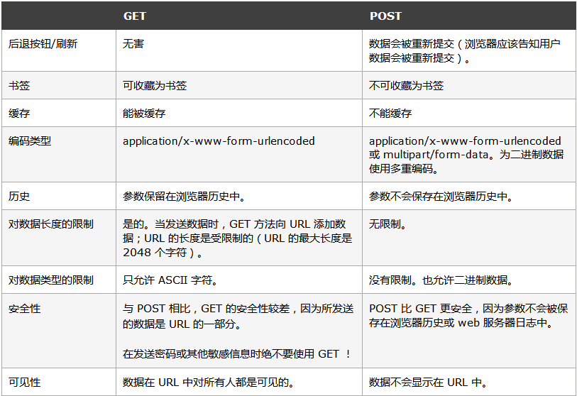

# 基础类

## CSS3 选择器有哪些

* `:first-child`选择某个元素的第一个子元素；
* `:last-child`选择某个元素的最后一个子元素；
* `:first-of-type`选择一个上级元素下的第一个同类子元素；
* `:last-of-type`选择一个上级元素的最后一个同类子元素；

* `:nth-child(n)`选择某个元素的一个或多个特定的子元素；
* `:nth-last-child(n)` 选择器匹配属于其元素的第 N 个子元素的每个元素，不论元素的类型，从最后一个子元素开始计数。
* `:nth-of-type(n)` 选择器匹配属于父元素的特定类型的第 N 个子元素的每个元素
* `:nth-last-of-type(n)`选择指定的元素，从元素的最后一个开始计算；

* `:only-child`选择的元素是它的父元素的唯一一个了元素；
* `:only-of-type`选择一个元素是它的上级元素的唯一一个相同类型的子元素；
* `:empty`选择的元素里面没有任何内容。
* `:not(selector)` 选择器匹配非指定元素/选择器的每个元素。

## HTML语义化

* 用正确的标签做正确的事情。
* html语义化让页面的内容结构化，结构更清晰，便于对浏览器，搜索引擎解析；
* 即使在没有样式CSS情况下也以一种文档格式显示，并且是容易阅读的；
* 搜索引擎的爬虫也依赖于HTML标记确定上下文和各个关键字的权重，利于SEO;
* 使阅读源代码的人对网站更容易将网站分块，便于阅读维护理解。

## 常见的浏览器内核

* `Trident`内核 [ˈtraɪdnt]：`IE`,`360`,搜狗浏览器等。
* `Gecko`内核[ˈɡekəʊ]：`Netscape6`及以上版本；
* `Presto`内核 [ˈprestəʊ]：`Opera7`及以上。
* `Webkit`内核：`Safari,Chrome`等。

## 简单介绍对浏览器内核的理解
主要分成两部分：渲染引擎和JS引擎。

* 渲染引擎：将代码转换成页面。负责取得网页的内容（HTML、XML、图像等等）、整理讯息（例如加入CSS等）、以及计算网页的显示方式，然后会输出至显示器或打印机。浏览器的内核的不同对于网页的语法解释会有不同，所以渲染的效果也不相同。所有网页浏览器、电子邮件客户端以及其他需要编辑、显示网络内容的应用程序都需要内核。
* JS引擎：解析和执行javascript来实现网页的动态效果。

最开始渲染引擎和JS引擎并没有区分得很明确，后来JS引擎越来越独立，内核就倾向于只指渲染引擎。

## src和href的区别
* src是指向外部资源的位置，指向的内容会嵌入到文档中当前标签所在的位置，在请求src资源时会将其指向的资源下载并应用到文档内，如js脚本，img图片和frame等元素。当浏览器解析到该元素时，会暂停其他资源的下载和处理，知道将该资源加载、编译、执行完毕，所以一般js脚本会放在底部而不是头部。
* href是指网络资源所在位置，建立和当前元素（锚点）或当前文档（链接）之间的链接，用于超链接。

## 选择器优先级
!important>行内样式>id选择器>类选择器>标签选择器>通配符>继承

## HTML5新标签
`header` `footer` `main` `nav` `aside` `article` `figcaption` `figure` `progress` `dialog` `bdi` `details`  `mark` `menuitem` `meter`  `rp` `rt` `ruby` `section` `summary` `time` `wbr`

## CSS 布局

#### 两栏布局(左侧宽度固定，右侧自适应)
* `float + margin`
* `float + overflow`
* `float + position`
* `flex`

#### 三栏布局(两边固定中间自适应)
* `float + margin`
* `position + margin`
* `flex`

[布局参考](https://www.cnblogs.com/xuepei/p/9990553.html)

## CSS 盒模型
#### W3C
`margin + border + padding + content`

#### IE
`margin + content` (content里面包含了padding border)

## cookie、localstorage、sessionstorage 的区别

## array方法有哪些
#### 不会改变原来数组的有：
* `concat`：连接两个或更多的数组，并返回结果。
* `every`：检测数组元素的每个元素是否都符合条件。
* `some` ：检测数组元素中是否有元素符合指定条件。
* `filter` ：检测数组元素，并返回符合条件所有元素的数组。
* `indexOf` ：搜索数组中的元素，并返回它所在的位置。
* `join` ：把数组的所有元素放入一个字符串。
* `toString` ：把数组转换为字符串，并返回结果。
* `lastIndexOf` ：返回一个指定的字符串值最后出现的位置，在一个字符串中的指定位置从后向前搜索。
* `map` ：通过指定函数处理数组的每个元素，并返回处理后的数组。
* `slice` ：选取数组的的一部分，并返回一个新数组。
* `valueOf` ：返回数组对象的原始值。
#### 会改变原来数组的有：
* `pop` ：删除数组的最后一个元素并返回删除的元素。
* `push` ：向数组的末尾添加一个或更多元素，并返回新的长度。
* `shift`： 删除并返回数组的第一个元素。
* `unshift` ：向数组的开头添加一个或更多元素，并返回新的长度。
* `reverse` ：反转数组的元素顺序。
* `sort`： 对数组的元素进行排序。
* `splice` ：用于插入、删除或替换数组的元素。

:::warning 注意
slice不会改变原数组，但是splice会直接改变原数组。
:::

## get 和 post 的区别

## 8种数据类型
* `Number`：typeof instance === "number"
* `String`：typeof instance === "string
* `Boolean`：typeof instance === "boolean"
* `Object`：typeof instance === "object"。
  
* `undefined`：typeof instance === "undefined"
* `null`：typeof instance === "object"
* `BigInt`：typeof instance === "bigint"
* `Symbol` ：typeof instance === "symbol"

## javascript内置对象有哪些
* `String`： 字符串对象
* `Array` ：数组
* `Boolean`： 布尔对象
* `Number` ：数值对象
* `Object` ：基础对象
* `Function` ：函数构造器
* `Arguments`： 函数参数集合
* `Error`： 异常对象
* `Date` ：日期时间
* `Math`： 数学对象
* `RegExp` ：正则表达式对象

## getElementsByClassName 和 querySelectorAll 的区别
* `querySelectorAll()`方法是HTML5新增的方法，通过传入一个css选择符，返回所有匹配的元素而不仅仅是一个元素。这个方法返回的是一个NodeList的实例
* `document.getElementsByClassName`是动态查询的过程，会随着dom结构的变化，得到的结点列表也会发生变化，而`querySelector`得到的是一个静态列表，它不会对dom结构进行动态查询。
