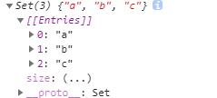
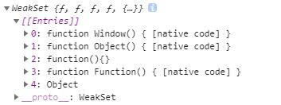
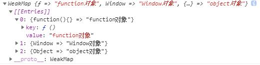

## var const 和 let 区别
* `var`声明的变量会挂载在window上，而let和const声明的变量不会
* `let` 是块作用域，即其在整个大括号 {} 之内可见
* `const` 变量一旦被赋值，就不能再改变了

## 数组扁平化，去重，排序
```JavaScript
var arr= [1, 2, [3, 4]].flat();
arr = Array.form(new Set(arr));
arr.sort()
```

## 结构赋值 变量值交换
```JavaScript
let a = 1;let b = 2;
[a,b] = [b,a];
```

## class类的继承
***ES5***
```javascript
function Student(name) {
    this.name = name;
}
Student.prototype.hello = function () {
    alert('Hello, ' + this.name + '!');
}
```
***ES6***
```javascript
class Student {
    constructor(name) {
        this.name = name;
    }

    hello() {
        alert('Hello, ' + this.name + '!');
    }
}
```

## 箭头函数，箭头函数的特点
1. 箭头函数this为父作用域的this，不是调用时的this
2. 箭头函数不能作为构造函数，不能使用new
3. 箭头函数没有arguments，caller
4. 箭头函数通过call和apply调用，不会改变this指向，只会传入参数
5. 箭头函数没有原型属性
6. 箭头函数不能作为Generator函数，不能使用yield关键字
7. 箭头函数返回对象时，要加一个小括号
8. 箭头函数在ES6 class中声明的方法为实例方法，不是原型方法
9. 多重箭头函数就是一个高阶函数，相当于内嵌函数

## Set WeakSet WeakMap 的区别
* `set`类似于数组，但是成员的值都是唯一的，没有重复的值。
```javascript
// 创建 Set
const letters = new Set();
// 向 Set 添加一些值
letters.add("a");
letters.add("b");
letters.add("c");
letters.add("c");
//Set(3) {"a", "b", "c"}
```

* `WeakSet`的成员只能是对象，而不能是其他类型的值。WeakSet中的对象都是弱引用，即垃圾回收机制不考虑WeakSet对该对象的引用，也就是说，如果其他对象都不再引用该对象，那么垃圾回收机制会自动回收该对象所占用的内存，不考虑该对象还存在于WeakSet之中。这个特点意味着，无法引用WeakSet的成员，因此WeakSet是不可遍历的。
```javascript
var set = new WeakSet();
var obj = {};
var fun = function(){};
set.add(obj).add(fun).add(Object).add(Function).add(Window);
```

* `WeakMap` 结构提供了[值:值]的对应，是一种更完善的Hash结构实现。如果你需要"键值对"的数据结构，Map比Object更合适。它类似于对象，也是键值对的集合，但是“键”的范围不限于字符串，各种类型的值（包括对象）都可以当作键,map可通过set赋值，get取值。
```javascript
var map = new WeakMap();
var obj = {};
var fun = function(){};
map.set(obj,"object对象").set(fun,"function对象").set(window,"Window对象")
```


## every 和 some 的区别
* `every`：一假即假,必须所有都返回true才会返回true，哪怕有一个false，就会返回false；
* `some`：一真即真, 只要其中一个为true 就会返回true

## promise 函数
* `Promise`是异步编程的一种解决方案
* `resolve` 把正确的值返回出去
* `reject` 把错误的值返回出去
* `then` 接收resolve的回调
* `catch` 接收reject的回调

## async 和 await
* `async` 异步函数,返回的是一个promise 对象，如果要获取到promise 返回值，我们应该用then 方法
* `await` 写异步代码就像写同步代码一样了，再也没有回调地域

