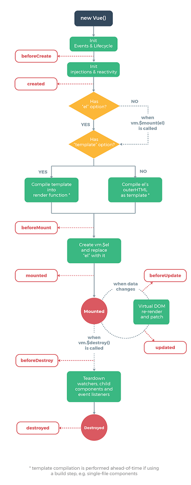
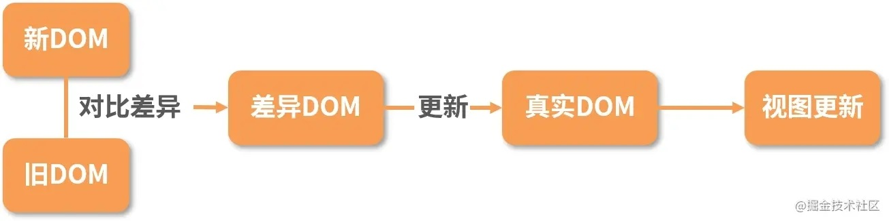

## vue 生命周期

* `beforeCreate` --- 创建前
* `created` --- 创建完成
* `beforeMount` --- 挂载前
* `mounted` --- 挂载完成
* `beforeUpdate` --- 更新前
* `updated` --- 更新完成
* `beforeDestroy` --- 销毁前
* `destroyed` --- 销毁完成

超链接: [跳转](https://juejin.cn/post/6844903811094413320)

## 你觉得 vue 有哪些特点
* 遵循`MVVM`模式
* 编码简洁，体积小，运行效率高，适合移动端/PC端
* 它本身只关注`UI`，可以轻松引入`Vue`插件或其他第三方库开发项目


## SPA了解吗
* 更好的用户体验，让用户在`web app`感受`native app`的速度和流畅
* 经典`MVC`开发模式，前后端各负其责
* 重前端，业务逻辑全部在本地操作，数据都需要通过`AJAX`同步、提交
* 在URL中采用#号来作为当前视图的地址,改变#号后的参数，页面并不会重载

## vue 父子组件通信
* 父向子通讯用`props`
* 子向父通讯用 点击事件通过`$.emit('xx')`向父组件`自定义`事件，然后父组件定义xx事件，xx事件调用相应的函数，函数内可接收子组件传过来的参数

## Computed 和 Methods 的区别
可以将同一函数定义为一个 method 或者一个计算属性。对于最终的结果，两种方式是相同的
#### 不同点：
computed: 计算属性是基于它们的依赖进行缓存的，只有在它的相关依赖发生改变时才会重新求值；

method 调用总会执行该函数。

## 过滤器的作用，如何实现一个过滤器
#### 使用场景：
需要格式化数据的情况，比如需要处理时间、价格等数据格式的输出 / 显示。

比如后端返回一个 年月日的日期字符串，前端需要展示为 多少天前 的数据格式，此时就可以用fliters过滤器来处理数据。
```html
<li>商品价格：{{item.price | filterPrice}}</li>
```
```javascript
 filters: {
    filterPrice (price) {
      return price ? ('￥' + price) : '--'
    }
  }
```


## vue的diff 算法
实际上，diff 算法探讨的就是虚拟 DOM 树发生变化后，生成 DOM 树更新补丁的方式。它通过对比新旧两株虚拟 DOM 树的变更差异，将更新补丁作用于真实 DOM，以最小成本完成视图更新。


#### 具体的流程如下：
* 真实的 DOM 首先会映射为虚拟 DOM；
* 当虚拟 DOM 发生变化后，就会根据差距计算生成 patch，这个 patch 是一个结构化的数据，内容包含了增加、更新、移除等；
* 根据 patch 去更新真实的 DOM，反馈到用户的界面上


## 为什么Vue中的v-if和v-for不建议一起用
v-for的优先级高与v-if，每次渲染都会先循环再进行条件判断，带来性能方面的浪费

## 简述Vue的响应式原理?
双向绑定采用数据劫持结合发布者-订阅者模式的方式，通过`Object.defineProperty()`来劫持各个属性的`setter`，`getter`，在数据变动时发布消息给订阅者，触发相应的监听回调。

## Computed 和 Watch 的区别
computed 计算属性 : 依赖其它属性值，并且 computed 的值有缓存，只有它依赖的属性值发生改变，下一次获取 computed 的值时才会重新计算 computed 的值。

watch 侦听器 : 更多的是观察的作用，无缓存性，类似于某些数据的监听回调，每当监听的数据变化时都会执行回调进行后续操作。

## 说说你对vuex的理解
* `state`：用一个对象就包含了全部的应用层级状态
* `getters`：用来从`store`中的`state`中派生出一些状态，例如对列表进行过滤并计数,可以认为是`store`的计算属性
* `mutations`:更改`Vuex`的`store`中的状态的唯一方法是提交`mutation`。`Vuex`中的`mutations`非常类似于事件：每个`mutation`都有一个字符串的事件类型(`type`)和一个回调函数(`handler`)。这个回调函数就是我们实际进行状态更改的地方，并且它会接受state作为第一个参数
* `actions`：`actions`类似于`mutation`，不同在于：`actions`提交的是`mutation`，而不是直接变更状态。`actions`可以包含任意异步操作。
* `Modules`：由于使用单一状态树，应用的所有状态会集中到一个比较大的对象。当应用变得非常复杂时，`store`对象就有可能变得相当臃肿。
  为了解决以上问题，`Vuex`允许我们将`store`分割成模块（`module`）。每个模块拥有自己的`state`、`mutation`、`action`、`getter`、甚至是嵌套子模块——从上至下进行同样方式的分割。  
  超链接: [跳转](https://juejin.cn/post/6924486801667162119)

## 给data数据的重新初始化
```javascript
//初始化 data 中的 obj 数据
Object.assign(this.$data.obj, this.$options.data().obj);

//初始化全部的 data数据
console.log(this.$data) //获取data当前的值
console.log(this.$options.data()) //获取data最初的值
Object.assign(this.$data,this.$options.data());//`Object.assign`数据合并会改变this.$data的值

```

## mixins 
`Mixins`：则是在引入组件之后与组件中的对象和方法进行合并，相当于扩展了父组件的对象与方法，可以理解为形成了一个新的组件。

#### mixins特点
1. 方法和参数在各组件中不共享
如混入对象中有一个 cont:1的变量,在组件A中改变cont值为5，这时候在组件B中获取这个值，拿到的还是1，还是混入对象里的初始值，数据不共享

2. 值为对象的选项
如methods,components等，选项会被合并，键冲突的组件会覆盖混入对象的，比如混入对象里有个方法A，组件里也有方法A，这时候在组件里调用的话，执行的是组件里的A方法

3. 值为函数的选项
如created,mounted等，就会被合并调用，混合对象里的钩子函数在组件里的钩子函数之前调用，同一个钩子函数里，会先执行混入对象的东西，再执行本组件的

## 封装一个完整的v-model 
#### 基本概念
`v-model` 实际上就是 `$emit('input')` 以及 `props:value` 的组合语法糖，只要组件中满足这两个条件，就可以在组件中使用 `v-model`。
虽然在有些交互组件中有些许不同，例如：

`checkbox` 和 `radio` 使用 `props:checked` 属性和 $emit('change') 事件。

`select` 使用 `props:value` 属性和 `$emit('change')` 事件。

但是，除了上面列举的这些，别的都是 `$emit('input')` 以及 `props:value` 。


#### 完整组件代码
```vue
<template>
  <div>
    <button @click="increase(-1)">-1</button>
    <input type="number" :value="currentValue" @input="changeValue" />
    <button @click="increase(1)">+1</button>
  </div>
</template>

<script>
  export default {
    name: "NumberInput",
    props:{
      value:{
        type: Number,
        default: 0,
        require: true
      }
    },
    data(){
      return{
        currentValue: this.value
      }
    },
    watch: {
      value(newVal){
        this.currentValue = newVal;
      }
    },
    methods:{
      changeValue(e){
        this.currentValue = parseInt(e.target.value);
        this.$emit('input', this.currentValue);
      },
      increase(value){
        this.currentValue+= value;
        this.$emit('input', this.currentValue);
      }
    }
  }
</script>
```
#### 使用方法
```vue
<NumberInput v-model="number"></NumberInput>
<script >
import NumberInput from "./NumberInput";

export default {
  components:{NumberInput},
  data(){
    return{
      number: 10
    }
  }
}
</script>
```
