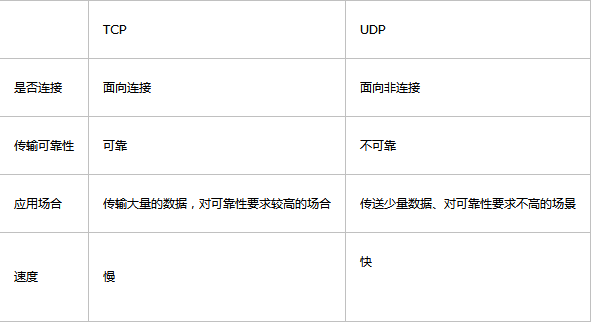
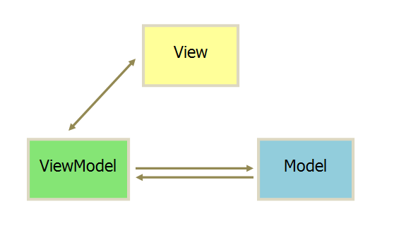
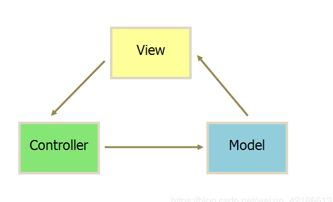
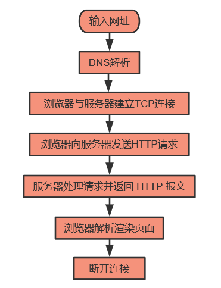
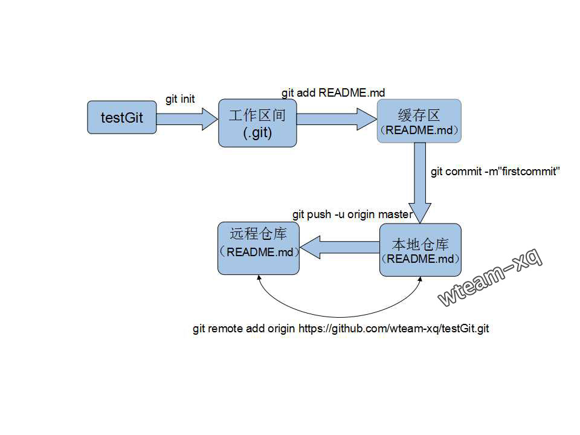

# 原理类

## settimeout 的机制
`javascript`是一门单线程语言,当`javascript`运行时遇到`setTimeout`后其实会另开一条线程

## TCP 和 UDP 的区别


## 了解MVVM MVC的区别
#### MVVM
  
* `ViewModel` 通过实现一套数据响应式机制自动响应Model中数据变化；
* 同时 `Viewmodel` 会实现一套更新策略自动将数据变化转换为视图更新；
* 通过事件监听响应View中用户交互修改 Model 中数据。
* 这样在 ViewModel 中就减少了大量DOM操作代码。

#### MVC
  
简单来说就是通过controller的控制去操作model层的数据，并且返回给view层展示
* `Model`：负责保存应用数据，与后端数据进行同步。
* `Controller`：负责业务逻辑，根据用户行为对 `Model` 数据进行修改。
* `View`：负责视图展示，将 `Model` 中的数据可视化出来。

## 网络七层协议


## http 和 https 的区别
* HTTP 的 URL 以 http:// 开头，而 HTTPS 的 URL 以 https:// 开头
* HTTP 是不安全的，而 HTTPS 是安全的
* HTTP 标准端口是 80 ，而 HTTPS 的标准端口是 443
* 在 OSI 网络模型中，HTTP 工作于应用层，而 HTTPS 工作在传输层
* HTTP 无需加密，而 HTTPS 对传输的数据进行加密
* HTTP 无需证书，而 HTTPS 需要认证证书

## 输入 url 到显示的过程

1. 输入网址： http://www.baidu.com
2. 通过DNS解析获得网址的对应IP地址
3. 浏览器与远程web服务器 通过TCP三次握手建立TCP/IP连接
4. 浏览器向web服务器发送一个HTTP请求
5. 服务器处理请求并返回HTTP报文
6. 浏览器解析渲染页面
7. 断开链接

## dns 解析过程
1. 现在我有一台计算机，通过ISP接入了互联网，那么ISP就会给我分配一个DNS服务器，这个DNS服务器不是权威服务器，而是相当于一个代理的dns解析服务器，他会帮你迭代权威服务器返回的应答，然后把最终查到IP返回给你。
2. 现在的我计算机要向这台ISPDNS发起请求查询www.baidu.com这个域名了，(经网友提醒：这里其实准确来说不是ISPDNS，而应该是用户自己电脑网络设置里的DNS，并不一定是ISPDNS。比如也有可能你手工设置了8.8.8.8)
3. ISPDNS拿到请求后，先检查一下自己的缓存中有没有这个地址，有的话就直接返回。这个时候拿到的ip地址，会被标记为非权威服务器的应答。
4. 如果缓存中没有的话，ISPDNS会从配置文件里面读取13个根域名服务器的地址（这些地址是不变的，直接在BIND的配置文件中），
5. 然后像其中一台发起请求。
6. 根服务器拿到这个请求后，知道他是com.这个顶级域名下的，所以就会返回com域中的NS记录，一般来说是13台主机名和IP。
7. 然后ISPDNS向其中一台再次发起请求，com域的服务器发现你这请求是baidu.com这个域的，我一查发现了这个域的NS，那我就返回给你，你再去查。
   （目前百度有4台baidu.com的顶级域名服务器）。
8. ISPDNS不厌其烦的再次向baidu.com这个域的权威服务器发起请求，baidu.com收到之后，查了下有www的这台主机，就把这个IP返回给你了，
9. 然后ISPDNS拿到了之后，将其返回给了客户端，并且把这个保存在高速缓存中

## https 具体的传输过程
1. 客户端通过TCP三次握手发起链接
2. 服务器将CA证书返回给客户端
3. 客户端验证服务器证书的合法性
4. 客户端生成随机对称秘钥
5. 将客户端生成的对称秘钥通过证书的公钥进行非对称加密发给服务器
6. 双方通过客户端生成的随机秘钥进行HTTP通信。


## 讲下git工作原理

[参考](https://www.sohu.com/a/115137833_494937)

## 讲下图片缓存和图片预加载
* **缓存**：浏览器在需要进行图片操作之前，会先查看本地是否有缓存，如果有，会先读取缓存；如果没有，才会去发起网络请求
* **预加载**：提升体验效果

## 讲下浏览器的渲染流程
1. 解析html建立dom树
2. 解析css构建render树（将CSS代码解析成树形的数据结构，然后结合DOM合并成render树）
3. 布局render树（Layout/reflow），负责各元素尺寸、位置的计算
4. 绘制render树（paint），绘制页面像素信息
5. 浏览器会将各层的信息发送给GPU，GPU会将各层合成（composite），显示在屏幕上。

## 进程，线程的概念，线程如何通讯

#### 讲一下栈和队列，项目或实际应用有哪些
**栈**：栈是一种先进后出的远测的有序集合。新添加或删除的元素都是从栈的末尾里操作的，栈的末尾称为栈顶，另一端称为栈底
```javascript
//创建一个类表示栈
function Stack(){
}
//定义一个数组来存储栈的元素
var arr=[];
add()//表示往栈顶里添加元素
del()//表示往栈顶里删除一个元素
topElement()//返回一个栈顶元素
isEmpty()//判断栈里是否为空，如果为空则返回true
clear()//清空栈里的元素
size()//返回栈里的元素个数

function Stack(arr){
	this.add=function(el){
		arr.push(el)
	}
	this.del=function(){
		arr.pop()
	}
	this.topElement(){
		return arr[arr.length-1]
	}
	this.isEmpty=function(){
		return arr.length==0
	}
	this.clear=function{
		arr=[]
	}
	this.size=function{
		return arr.length
	}
	
}
//实例化栈对象
var Stack=new Stack(arr);
```
**队列**：队列是先进先出原则，添加元素是从队尾添加，删除元素是从队首删除，最新的元素是在队尾
```javascript
//创建一个类表示队列
function Queue(){
}
//定义一个数组存储队列元素
var arr=[]
add()//表示向队尾添加一个元素
del()//表示向队首删除一个元素
front()//返回队首的元素
isEmpty()//判断队列是否空
clear()//清空队列里的元素
size()//返回队列里的元素个数
function Queue(arr){
	this.add=function(el){
		arr.push()
	}
	this.del=function(){
		arr.shift()
	}
	this.front=function(){
		return arr[0]
	}
	this.isEmpty=function(){
		return arr.length==0
	}
	this.clear=function(){
		arr=[]
	}
	this.size=function(){
		return arr.length
	}
}
//实例化一个队列对象
var Queue=new Queue(arr);
```
## 请解释一下JavaScript的同源策略。
* 在客户端编程语言中，如j`avascript`和 `ActionScript`，同源策略是一个很重要的安全理念，它在保证数据的安全性方面有着重要的意义。  
* 同源策略规定跨域之间的脚本是隔离的，一个域的脚本不能访问和操作另外一个域的绝大部分属性和方法。
#### 什么叫相同域，什么叫不同的域？  
* 当两个域具有相同的协议, 相同的端口，相同的`host`，那么我们就可以认为它们是相同的域。  
* 同源策略还应该对一些特殊情况做处理，比如限制`file`协议下脚本的访问权限。  
* 本地的HTML文件在浏览器中是通过`file`协议打开的，如果脚本能通过`file`协议访问到硬盘上其它任意文件，就会出现安全隐患，目前`IE8`还有这样的隐患 
