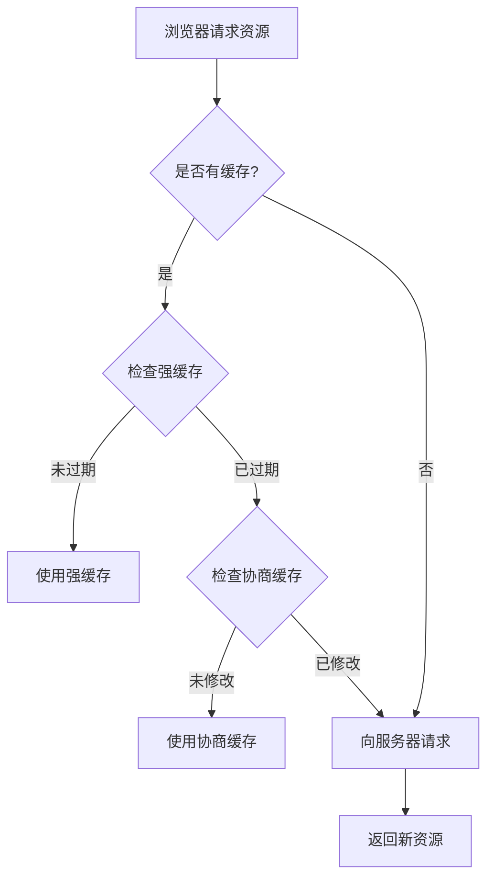

## JavaScript 事件循环机制是什么？

### 事件循环的核心概念

1. 执行栈：同步代码执行的地方
2. 任务队列：
   - 宏任务（macrotask）：setTimeout, setInterval, I/O, UI渲染
   - 微任务（microtask）：Promise.then, process.nextTick, MutationObserver

### 执行顺序示例

```javascript
console.log('1');  // 同步任务

setTimeout(() => {
  console.log('2');  // 宏任务
}, 0);

Promise.resolve().then(() => {
  console.log('3');  // 微任务
});

console.log('4');  // 同步任务

// 输出顺序：1 -> 4 -> 3 -> 2
```

**执行规则**：

1. 执行同步代码
2. 清空微任务队列
3. 执行一个宏任务
4. 重复步骤2-3

## 深拷贝和浅拷贝有什么区别？

### 核心区别

1. 浅拷贝：只复制对象的第一层属性，引用类型的属性仍指向原始引用
2. 深拷贝：递归复制对象的所有层级，创建全新的数据副本

### 实现方式与示例

**浅拷贝实现方式**：

```javascript
// 方法1：Object.assign
const obj = { a: 1, b: { c: 2 } };
const shallowCopy1 = Object.assign({}, obj);

// 方法2：展开运算符
const shallowCopy2 = { ...obj };
```

**深拷贝实现方式**：

```javascript
// 完整的深拷贝实现
function deepClone(obj, hash = new WeakMap()) {
    if (obj === null || typeof obj !== 'object') return obj;
    if (obj instanceof Date) return new Date(obj);
    if (obj instanceof RegExp) return new RegExp(obj);
    
    // 处理循环引用
    if (hash.has(obj)) return hash.get(obj);
    
    const cloneObj = Array.isArray(obj) ? [] : {};
    hash.set(obj, cloneObj);
    
    for (let key in obj) {
        if (obj.hasOwnProperty(key)) {
            cloneObj[key] = deepClone(obj[key], hash);
        }
    }
    return cloneObj;
}
```

## JavaScript 原型链是什么？

### 核心概念

1. 原型（prototype）：对象的模板，包含可以被继承的属性和方法
2. 原型链：对象通过 **proto** 属性连接的查找链条

### 原理与示例

```javascript
// 构造函数
function Animal(name) {
    this.name = name;
}

// 原型方法
Animal.prototype.sayName = function() {
    console.log(this.name);
};

// 创建实例
const cat = new Animal('猫咪');

// 原型链查找过程
console.log(cat.__proto__ === Animal.prototype);         // true
console.log(Animal.prototype.__proto__ === Object.prototype); // true
console.log(Object.prototype.__proto__ === null);        // true
```

**原型链特点**：

1. 属性查找顺序：实例 -> 构造函数原型 -> Object.prototype -> null
2. 所有对象都继承自 Object.prototype
3. 原型链的终点是 null

## 如何优化前端首屏加载速度？

### 核心优化策略

1. 资源优化
   - 路由懒加载
   - 组件按需加载
   - 图片懒加载
   - 资源压缩

2. 缓存优化
   - 浏览器缓存
   - CDN缓存
   - Service Worker

3. 渲染优化
   - 服务端渲染(SSR)
   - 静态页面预渲染
   - 骨架屏

### 代码实现示例

```javascript
// 路由懒加载
const routes = [
  {
    path: '/user',
    component: () => import('./views/User.vue')
  }
];

// 组件按需加载
import { Button } from 'element-ui';
Vue.use(Button);

// 图片懒加载


// Gzip压缩配置
const CompressionPlugin = require('compression-webpack-plugin');
module.exports = {
  configureWebpack: {
    plugins: [
      new CompressionPlugin({
        test: /\.(js|css|html)$/,
        threshold: 10240
      })
    ]
  }
};
```

**优化效果衡量**：

1. 首屏时间（FCP）降低到 1.5s 以内
2. 页面完全可交互时间（TTI）控制在 3s 以内
3. 核心资源大小控制在 200KB 以内

## 前端性能优化有哪些方案？

### 核心优化方向

1. **网络传输优化**
   - HTTP请求优化
   - 资源压缩
   - 缓存策略

2. **页面渲染优化**
   - CSS/JS 优化
   - DOM 操作优化
   - 回流重绘优化

3. **代码层面优化**
   - 代码分割
   - 树摇优化
   - 延迟加载

### 具体实现方案

```javascript
// 1. 资源合并压缩
// webpack配置
module.exports = {
  optimization: {
    minimize: true,
    splitChunks: {
      chunks: 'all'
    }
  }
}

// 2. 图片懒加载
const observer = new IntersectionObserver((entries) => {
  entries.forEach(entry => {
    if (entry.isIntersecting) {
      const img = entry.target;
      img.src = img.dataset.src;
      observer.unobserve(img);
    }
  });
});

// 3. 防抖函数
function debounce(fn, delay) {
  let timer = null;
  return function(...args) {
    clearTimeout(timer);
    timer = setTimeout(() => {
      fn.apply(this, args);
    }, delay);
  }
}
```

**关键优化点**：

1. 减少HTTP请求：合并文件、雪碧图、base64编码
2. 使用缓存：浏览器缓存、CDN缓存、Service Worker
3. 压缩资源：Gzip、图片压缩、代码压缩
4. 代码优化：代码分割、树摇、延迟加载
5. 预加载：资源预加载、DNS预解析

## 前端安全问题有哪些？如何防范？

### 主要安全问题

1. **XSS攻击**（跨站脚本攻击）
2. **CSRF攻击**（跨站请求伪造）
3. **点击劫持**
4. **SQL注入**
5. **密码安全**

### 防范措施与示例

```javascript
// 1. XSS防范
// 转义HTML字符
function escapeHtml(str) {
  return str.replace(/[&<>"']/g, (match) => {
    const escape = {
      '&': '&amp;',
      '<': '&lt;',
      '>': '&gt;',
      '"': '&quot;',
      "'": '&#39;'
    };
    return escape[match];
  });
}

// 2. CSRF防范
// 添加CSRF Token
const csrfToken = Math.random().toString(36).slice(2);
fetch('/api/data', {
  headers: {
    'X-CSRF-Token': csrfToken
  }
});

// 3. 点击劫持防范
// 设置HTTP Header
response.setHeader('X-Frame-Options', 'SAMEORIGIN');
```

**安全最佳实践**：

1. 输入验证和转义
2. 使用HTTPS
3. 实施CSP（内容安全策略）
4. 使用安全的Cookie属性
5. 定期更新依赖包

## 浏览器缓存机制是什么？

### 缓存分类

1. **强缓存**
   - Cache-Control
   - Expires

2. **协商缓存**
   - Last-Modified / If-Modified-Since
   - ETag / If-None-Match

### 实现机制与示例

```javascript
// 服务器端设置缓存头
app.get('/api/data', (req, res) => {
  // 设置强缓存
  res.setHeader('Cache-Control', 'max-age=3600');
  
  // 设置协商缓存
  const etag = generateETag(data);
  res.setHeader('ETag', etag);
  
  if (req.headers['if-none-match'] === etag) {
    res.status(304).end();
  } else {
    res.json(data);
  }
});
```

**缓存策略选择**：

1. 频繁变动的资源：使用协商缓存
2. 静态资源：使用强缓存
3. 不需要缓存的资源：Cache-Control: no-store
4. API响应：根据业务需求选择合适的缓存策略

### 缓存流程图



# 高级

## 前端性能监控应该关注哪些指标？

### 核心性能指标

1. 页面加载指标
   - FCP (First Contentful Paint): 首次内容绘制
   - LCP (Largest Contentful Paint): 最大内容绘制
   - TTI (Time to Interactive): 可交互时间

2. 用户体验指标
   - FID (First Input Delay): 首次输入延迟
   - CLS (Cumulative Layout Shift): 累积布局偏移

3. 资源加载指标
   - 资源加载时间
   - 资源大小
   - 请求数量

### 监控实现方式

```javascript
// 使用 Performance API 获取性能指标
const performance = window.performance;

// 获取页面加载时间
const timing = performance.timing;
const pageLoadTime = timing.loadEventEnd - timing.navigationStart;

// 使用 PerformanceObserver 监听性能指标
new PerformanceObserver((entryList) => {
  const entries = entryList.getEntries();
  entries.forEach(entry => {
    console.log(`${entry.name}: ${entry.startTime}ms`);
  });
}).observe({ entryTypes: ['paint', 'largest-contentful-paint'] });
```
