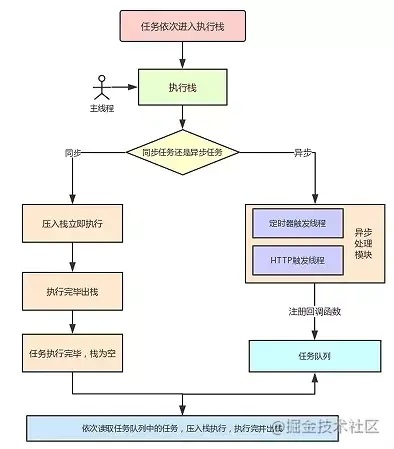

## 双向绑定proxy和defineProperty
defineProperty 数据劫持比较好理解,通常我们利用Object.defineProperty劫持对象的访问器,在属性值发生变化时我们可以获取变化
```javascript
var data = {
        k:''
    }
    Object.defineProperty(data,'k',{
        enumerable:true,
        configurable:true,
        get:function(){//获取data.k值时会被打印
            console.log('data.k的值被获取了')
        },
        set:function(){//改变data.k值时会被打印
            console.log('data.k的值被改变了')
        }
    })

    data.k = 1;
    data.k;
```
缺陷：无法监听数组变化

```javascript
var data = {
        k:''
    }
    let newData = new Proxy(data,{
        get:function(){//获取data.k值时会被打印
            console.log('data.k的值被获取了')
        },
        set:function(){//改变data.k值时会被打印
            console.log('data.k的值被改变了')
        }
    })
    newData.k = 1;
    newData.k;
```
Proxy返回的是一个新对象,我们可以只操作新的对象达到目的,而Object.defineProperty只能遍历对象属性直接修改。  
[参考](https://www.jianshu.com/p/2df6dcddb0d7)

## 页面监控
* 数据采集 --> 数据上报 --> 服务端处理 --> 数据库存储 --> 数据监控可视化平台
* `Performance` 接口可以获取到当前页面中与性能相关的信息，它是 `High Resolution Time API` 的一部分，同时也融合了 `Performance` `Timeline API`、`Navigation Timing API`、 `User Timing API` 和 `Resource Timing API`。

## eventloop事件循环
**背景**  
JavaScript 是一门 单线程 语言，即同一时间只能执行一个任务，即代码执行是同步并且阻塞的。为了实现主线程的不阻塞，Event Loop这样的方案应运而生  
  
在JavaScript中所有同步任务都在主线程上执行，这就形成一个执行栈。  
而异步任务会被放置到异步处理模块中，当异步任务有了运行结果，就将该函数移入任务队列。  
一旦执行栈中的所有同步任务执行完毕，引擎就会读取任务队列，然后将任务队列中的第一个任务放入执行栈中运行。  
只要主线程空了，就会去读取任务队列，该过程不断重复，这就是所谓的 `事件循环`。  

## 深拷贝和浅拷贝
浅拷贝只复制指向某个对象的指针，而不复制对象本身，新旧对象还是共享同一块内存  
深拷贝会另外创造一个一模一样的对象，新对象跟原对象不共享内存，修改新对象不会改到原对象。  
```javascript
//深拷贝
function deepClone(obj){
    //判断参数是不是一个对象
    let objClone = obj instanceof Object?[]:{};
    if(obj && typeof obj==="object"){
        for(key in obj){
            if(obj.hasOwnProperty(key)){
                //判断ojb子元素是否为对象，如果是，递归复制
                if(obj[key]&&typeof obj[key] ==="object"){
                    objClone[key] = deepClone(obj[key]);
                }else{
                    //如果不是，简单复制
                    objClone[key] = obj[key];
                }
            }
        }
    }
    return objClone;
}
```
## 原型和原型链
* 在JavaScript中是使用构造函数来新建一个对象的，每一个构造函数的内部都有一个 prototype 属性，它的属性值是一个对象，这个对象包含了可以由该构造函数的所有实例共享的属性和方法。当使用构造函数新建一个对象后，在这个对象的内部将包含一个指针，这个指针指向构造函数的 prototype 属性对应的值，这个指针被称为对象的原型。  

* 当访问一个对象的属性时，如果这个对象内部不存在这个属性，那么它就会去它的原型对象里找这个属性，这个原型对象又会有自己的原型，于是就这样一直找下去，这就叫原型链
## proto 和 prototype 的区别
1. 对象有属性`__proto__`,指向该对象的构造函数的原型对象。
2. 方法除了有属性`__proto__`,还有属性`prototype`，`prototype`指向该方法的原型对象。

## 前端性能优化
* 减少请求数量 图片合并 雪碧图 `Base64` 使用字体图标来代替图片
* 减少重定向 使用缓存 不使用`CSS @import` 避免使用空的`src`和`href`
* 减小资源大小 `js/css/html/img`
* 优化网络连接 使用CDN 使用DNS预解析
* 优化资源加载 资源加载位置 资源加载时机
* 减少重绘回流 防抖和节流 及时清理环境
* 性能更好的API 用对选择器 使用`requestAnimationFrame`来替代`setTimeout`和`setInterval` 使用`IntersectionObserver`来实现图片可视区域的懒加载 使用`web worker`
* `webpack`优化 动态导入和按需加载 剔除无用代码 长缓存优化
